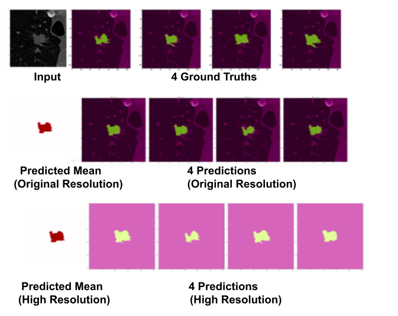

# Probabilistic Image Segmentation With Continuous Shape Representations

## Overview

Welcome to the Probabilistic Image Segmentation project repository. This repository contains the code and resources for Probabilistic Image Segmentation, a project developed at the Zuse Institute Berlin.

### Project Description

The primary objective of this project is to address the challenge of image segmentation, specifically focusing on scenarios where there are multiple ground truth annotations for a single image, leading to what we refer to as "ambiguous images.". We offer both deterministic and stochastic models for generating image segmentations based on a given ground truth CT image.

### Key Features

With this project, you can:

- **Deterministic Model:** Train and utilize a deterministic model that predicts a single image (or generates one) while offering options to adjust the resolution to suit your needs.

- **Stochastic Model:** Train and use a stochastic model that predicts both mean and covariance, enabling the generation of multiple predictions. Similar to the deterministic model, you can also generate high-resolution images.

### Getting Started

For detailed information, please refer to the https://opus4.kobv.de/opus4-zib/frontdoor/index/index/docId/8972 .

### Citation

If you find this project useful for your research or work, we kindly request that you cite our work by referencing our 

@mastersthesis{Şirin2023, 
  author      = {Ege Şirin}, 
  title       = {Probabilistic Image Segmentation With Continuous Shape Representations}, 
  year        = {2023}, 
}

